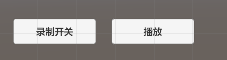
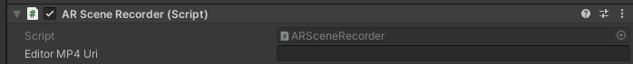

### 配置

1. [配置 ARCore 会话](https://developers.google.cn/ar/develop/unity-arf/session-config?hl=fi)，配置好AR 基础和**ARCore 扩展**
2. 在ARCamera下添加3个组件：AR Playback Manager、AR Recording Manager、AR Scene Recorder。AR Playback Manager、AR Recording Manager为AR Core自带，AR Scene Recorder为scripts文件夹下的脚本。
3. debug信息下，添加两个按钮，分别绑定AR Scene Recorder的StartOrStopRecord()和Playback()，作为录制开关和播放按钮。

### 录制

- 点击录制按钮即开始录制，再次点击录制按钮即结束录制
- 录制MP4文件存储在手机文件夹：/storage/emulated/0/DCIM/ARproject/videos/下，MP4命名规则按照每次APP打开的时间，单词打开多次点击录制会覆盖视频文件，需要录制多个可以关闭再打开app。

### 播放

手机端录制结束后，点击播放会播放本次录制的视频

Editor端，需要配置AR Scene Recorder的mp4地址，然后点击播放按钮进行播放

